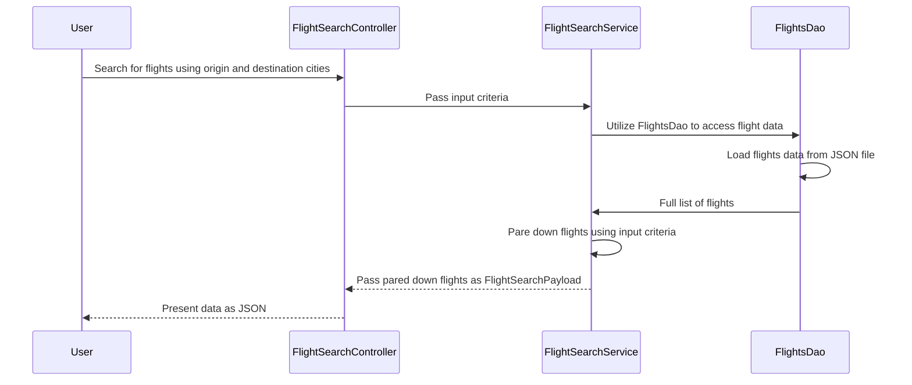

# Airline-POC

## Description
This POC is a basic example of how I write microservices.  It adheres to SOLID principals. Using various good practices such as all dependencies injected via constructors, services for business logic, repositories for data management, and containerization for ease of scalability.

The service is baseed on a simple flight search. Its source data consists of a JSON file and is queried via Linq.  Logging is implemented via Serilog. Seq is also utilized for log management. 

## Flight Search Sequence Diagram

## Running the project 
### Requirements 
 - NET 8
 - Docker Desktop or other Docker Environment
 - Visual Studio/Rider/VS.Code

### Setup
Docker Desktop is not necessarily required but you would need to run Seq somewhere otherwise you will need to disable the Seq sink in  appsettings. You should be able to simply clone the project and run docker compose in Visual Studio.  If everything went well the FlightSearch swagger will pop up in a browser. You can also access Seq using the standard Seq URL of http://localhost:5341.

### Running 
You can use any of the following city pairs to return data from the service. The source JSON is located in data/Flights.json.
- DEN to JFK
- DEN to ORD
- DEN to LAX
- SEA to SFO
- SEA to DFW
- SEA to MIA

### Testing 
A quick note on testing. I used NSubstitute over Moq for unit testing because of Moq was harvesting emails a while back using SponsorLink. You can read more about that fiasco [here](https://www.techradar.com/pro/top-open-source-project-moq-slammed-for-secretly-collecting-user-data).
